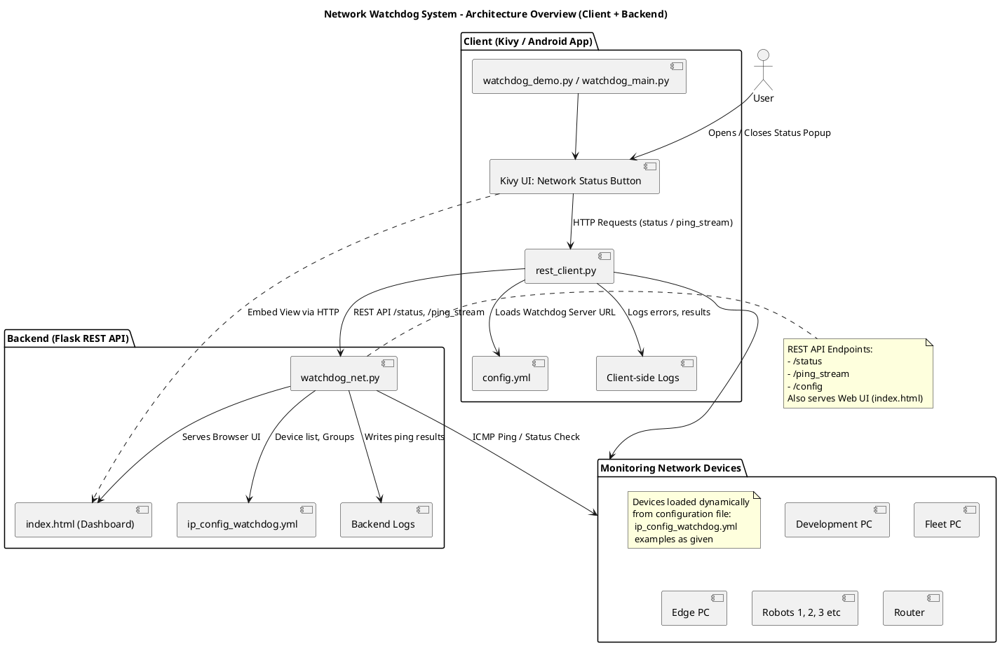

# Network Watchdog

[](LICENSE)
[](https://www.python.org/)
[](https://flask.palletsprojects.com/)
[]()

> **Professional network monitoring solution with real-time device tracking and comprehensive logging**

This project is a local server-based network monitoring tool called **Network Watchdog**. It continuously checks the reachability and latency of devices on your network, providing real-time status updates and historical logs through a web interface using a Flask application.

---

## Table of Contents

- [Overview](#overview)
- [System Architecture](#system-architecture)
- [Network Behavior](#network-behavior)
- [Features](#features)
- [Directory Structure](#directory-structure)
- [Installation](#installation)
- [Configuration](#configuration)
- [Usage](#usage)
- [Web Interface](#web-interface)
- [Logs](#logs)
- [Testing](#testing)
- [Future Improvements](#future-improvements)
- [Contribution](#contribution)
- [Author](#author)

---

## Overview

**Network Watchdog** operates as a **local web server** that provides comprehensive network monitoring capabilities:

### Core Functionality
- **Flask Backend**: Runs a Python Flask web server on your machine
- **HTML Frontend**: Serves web pages through your browser using HTML templates
- **Real-time Communication**: Uses WebSocket connections for live ping updates
- **Network Monitoring**: Continuously pings configured devices using ICMP packets
- **Local Hosting**: Creates a web server accessible via `localhost:5000` and your machine's IP address
- **Cross-Device Access**: Other devices on the same network can access the interface using your machine's IP

### Technical Capabilities
- **Configuration**: Device IPs are managed via a YAML file for easy updates
- **Logging**: All ping results are logged to timestamped files for historical reference
- **Testing**: Includes unit tests to ensure functionality
- **Cross-Platform**: Works on any system with Python and Flask installed
- **Real-time Updates**: Uses Flask-SocketIO for live data streaming
- **Simple Setup**: Requires minimal configuration to get started

### User Experience
- **Responsive Design**: Accessible from any modern web browser
- **Automatic IP Detection**: Displays current server IP in terminal output for easy access
- **Device Reachability**: Provides a dashboard showing device status (reachable/unreachable)
- **Latency Tracking**: Displays latency information for each device
- **User-Friendly Interface**: Easy to navigate web interface with device selection dropdown
- **Live Stream**: Displays live ping results for selected devices
- **Status Summary**: Shows overall status of all monitored devices

### Management Features
- **YAML Configuration**: Allows easy addition/removal of devices without code changes
- **Log Management**: Automatically creates log files in a dedicated directory
- **Cross-Browser Compatibility**: Works on Chrome, Firefox, Safari, etc.
- **Developer Support**: Available on Bitbucket for contributions and improvements

---

## System Architecture

The following diagram illustrates how Network Watchdog works and its system components:

```plantuml
@startuml Network_Watchdog_Architecture
!theme plain
skinparam backgroundColor #FFFFFF
skinparam componentStyle rectangle

title Network Watchdog - System Architecture v1.0.1

package "Network Watchdog Application" {
    package "Configuration Layer" {
        [YAML Config] as config
        note right of config
            ip_config_watchdog.yml
            - Device names
            - IP addresses
            - Priority levels
            - Enable/disable flags
            - HATS server endpoints
        end note
    }
    
    package "Core Application" {
        [Flask Web Server] as flask
        [Ping Monitor Engine] as ping
        [WebSocket Handler] as websocket
        [File Logger] as logger
        [REST API Handler] as rest_api
        
        flask --> ping : Controls
        flask --> websocket : Real-time updates
        flask --> logger : Log data
        flask --> rest_api : API requests
        ping --> logger : Ping results
        rest_api --> ping : Monitor commands
    }
    
    package "Web Interface" {
        [HTML Templates] as html
        [JavaScript Client] as js
        [Dashboard UI] as dashboard
        [Mobile Interface] as mobile_ui
        
        html --> js : Interactive UI
        js --> dashboard : Data visualization
        dashboard --> mobile_ui : Responsive design
        js --> rest_api : HTTP requests
    }
    
    package "Storage Layer" {
        [Log Files] as logs
        [Configuration Cache] as cache
        
        note right of logs
            Enhanced logging:
            watchdog_YYYY-MM-DD-HH-MM.txt
            - Structured data
            - Performance metrics
            - Error tracking
        end note
    }
    
    package "Future Extensions" #LightGray {
        [Alert System] as alerts
        [Analytics Engine] as analytics
        [Multi-tenant Support] as multitenancy
        [AI Diagnostics] as ai_diag
        [HATS Integration] as hats_future #LightGray
        
        note right of alerts
            Phase 1-4 Roadmap:
            - Email/SMS/Slack alerts
            - Data visualization
            - Enterprise features
            - AI-powered diagnostics
            - HATS server integration
            - Robot action handlers
        end note
    }
}

package "Network Infrastructure" {
    [WiFi Router/DHCP] as router
    [Target Devices] as devices
    
    note right of devices
        Monitored devices:
        - Servers & workstations
        - IoT devices & sensors
        - Network equipment
        - Printers & peripherals
        - Cloud services
        - HATS servers (future)
        - Robot controllers (future)
    end note
}

package "Client Access Points" {
    [Local Browser] as local
    [Remote Browser] as remote
    [Android Device] as android
    [Tablet Interface] as tablet
    [Mobile App] as mobile_app #LightGray
    
    note right of android
        Cross-platform support:
        - Desktop browsers
        - Android devices
        - Tablets
        - Future: Native mobile app
    end note
}

package "Integration Points" #LightBlue {
    [Monitoring Tools] as monitoring #LightGray
    [Cloud Services] as cloud #LightGray
    [Notification Services] as notifications #LightGray
    
    note right of monitoring
        Future integrations:
        - REST API for external systems
        - Cloud storage (AWS, Azure) like HATS plugin
        - Robot control systems
        - Nagios, Prometheus, Grafana
        - Slack, Teams, Email
        - CI/CD pipelines
    end note
}

' Main connections
config --> flask : Load devices
flask --> logs : Write logs
flask --> cache : Cache config
ping --> devices : ICMP ping
router --> flask : Assigns IP

' Client connections
local --> flask : http://127.0.0.1:5000
remote --> flask : http://YOUR_IP:5000
android --> mobile_ui : http://YOUR_IP:5000
tablet --> dashboard : Responsive UI

' Future connections (dotted lines)
alerts -.-> notifications : Phase 1
analytics -.-> monitoring : Phase 4
multitenancy -.-> cloud : Phase 3
ai_diag -.-> analytics : Phase 4
hats_future -.-> monitoring : HATS integration

' Network behavior
router --> router : IP changes\nwhen switching\nWiFi networks

note bottom
    **Current Implementation (v1.0.2):**
    • Flask server binds to 0.0.0.0:5000
    • localhost (127.0.0.1) always works locally
    • Network IP changes with WiFi switching
    • Real-time updates via WebSocket
    • All ping data logged to files
    • Android device compatibility
    
    **Future Roadmap:**
    • Phase 1: REST API + Service Management + Alerting
    • Phase 2: HATS server integration + Robot action handlers
    • Phase 3: Analytics + Reporting + Web Config
    • Phase 4: Multi-tenant + Access Control + Topology
    • Phase 5: Integrations + AI Diagnostics + Automation
    
end note

@enduml
```




### Architecture Components

1. **Configuration Layer**: YAML-based device configuration
2. **Core Application**: Flask server with ping monitoring and logging
3. **Web Interface**: HTML templates with JavaScript for real-time updates
4. **Storage Layer**: File-based logging system
5. **Network Infrastructure**: Router/DHCP and target devices
6. **Client Access**: Multiple access methods (local/remote browsers, Android tablet)

### Technical Architecture

- **Server**: Flask application running on port 5000
- **Frontend**: HTML/JavaScript interface with real-time updates
- **Communication**: REST API endpoints + WebSocket for live data
- **Storage**: Local file logging for historical data
- **Configuration**: YAML-based device management

---

## Network Behavior

### Why Server IP Changes When Switching WiFi

When you change WiFi networks, the server IP address changes because:

- **DHCP Assignment**: Each network's router assigns IP addresses from its own range
- **Network Isolation**: Different networks use different IP address ranges
- **Automatic Detection**: Flask automatically binds to your new network IP

**Example:**
```bash
# Home WiFi Network
* Running on http://192.168.1.100:5000

# Office WiFi Network
* Running on http://10.0.0.50:5000

# Mobile Hotspot
* Running on http://172.20.10.2:5000
```

### Access Methods

- **Local Access**: `http://localhost:5000` (always works on the host machine)
- **Network Access**: `http://YOUR_CURRENT_IP:5000` (for other devices on same network)
- **IP Detection**: Check terminal output when starting the application

---

## Features

**Network Watchdog** is a Flask-based application that provides:

- **Real-time device monitoring** - Continuous network device status tracking
- **Live ping stream for selected devices** - Interactive device-specific monitoring
- **Status dashboard with reachability and latency information** - Comprehensive network overview
- **Automatic logging of all monitoring data** - Historical data preservation
- **Simple web interface accessible from any browser** - Universal accessibility
- **Device configuration via YAML files** - Easy configuration management
- **Cross-platform network access** - Any device with a web browser can access

---
## REST API Watchdog System Architecture Design

The following diagram illustrates how the REST API-based Network Watchdog system is structured.
This architecture focuses on client-server interaction through HTTP REST API and WebSocket for real-time updates. The target devices are dynamically managed from the configuration file.



### Architecture Highlights
- Client (Kivy / Android App) communicates with backend via HTTP REST APIs.
- Backend (Flask REST API) handles monitoring and visualization via Web UI.
- Monitoring Devices list is dynamic, loaded from YAML configuration.
- Device health is checked via ICMP (ping), results shown via Dashboard.

### Core Flow:
- Client App (Kivy / Android) triggers REST APIs to monitor device status.
- Backend Server (Flask) handles API requests and device pings.
- Monitoring Devices are dynamically defined in the YAML config file, not hardcoded.


## Directory Structure

```
watchdog/
├── config/                # YAML configuration files for device IPs
│   └── ip_config_watchdog.yml
├── logs/                  # Directory for log files
├── templates/             # Flask HTML templates
│   └── index.html
├── test/
│   ├── config/            # Test configuration files
│   │   └── ip_config_watchdog.yml
│   ├── logs/
│   ├── run_tests.py
│   └── test_watchdog_net.py
├── watchdog_net.py        # Main application script
├── README.md
├── requirements.txt       # Python dependencies 
└── __init__.py
```

For REST API:

```
hats_fleet_kachaka_rest_client/
├── Client/
│   ├── Images/                      # UI and demo screenshots
│   │   ├── Dropdown_activated.png
│   │   ├── GUI_init.png
│   │   ├── pydroid3_browse.JPG
│   │   ├── pydroid3_desktop.JPG
│   │   ├── pydroid3_open_menu.JPG
│   │   ├── pydroid3_start_main.JPG
│   │   ├── room_selection_jp_cafe.png
│   │   └── room_selection_jp_kachaka.png
│   ├── __pycache__/                 # Python cache
│   │   └── rest_client.cpython-310.pyc
│   ├── assets/                      # App assets (fonts, images, sounds)
│   │   ├── fonts/
│   │   │   └── NotoSansJP-VariableFont_wght.ttf
│   │   ├── img/
│   │   │   ├── hats_logo.png
│   │   │   └── kachaka.jpg
│   │   └── signal_succeed.mp3
│   ├── build_android_cafe.sh        # Build script (cafe environment)
│   ├── build_android_kachaka.sh     # Build script (kachaka environment)
│   ├── buildozer.spec               # Android build spec file
│   ├── clean_android_cafe.sh        # Clean build (cafe)
│   ├── clean_android_kachaka.sh     # Clean build (kachaka)
│   ├── config.yml                   # General configuration
│   ├── config_cafe.yml              # Cafe-specific config
│   ├── config_kachaka.yml           # Kachaka-specific config
│   ├── jp_v2_main.py                # Japan version main app
│   ├── logs/                        # Client logs directory
│   ├── main.py                      # Main entry-point
│   ├── rest_client.py               # REST API client
│   ├── watchdog_demo.py             # Demo app
│   └── watchdog_main.py             # Production app
├── README.md                        # Project documentation
├── Test/
│   ├── app/
│   │   └── main.py                  # Test server main app
│   ├── get.sh                       # Script for GET API test
│   ├── get_scenario_start.sh        # Start test scenario
│   ├── start_test_server.sh         # Test server script
│   └── test_spec.md                 # Test specification
└── requirements.txt                 # Python dependencies

```

## Installation

### Prerequisites

- Python 3.6 or higher
- Flask
- Flask-SocketIO
- Flask-Cors
- Flask-RESTful
- Flask-Testing
- PyYAML
- pip3
- pytest
- pytest-flask

### Setup

Clone the repository:

```bash
git clone git@bitbucket.org:qibitech/watchdog.git
# or use your https link for instance: 
git clone https://<your_username>@bitbucket.org/qibitech/watchdog.git
```
check inside watchdog directory
```bash
cd watchdog

```
- Note:
For only server based monitoring using current main branch after git clone
- For rest api and android GUI monitoring, switch this branch 
    - git checkout feature/HKD-157-implement-a-network_watch-dog

Ensure you have `pip3` installed. If not, install it using your package manager:

```bash
# For Debian/Ubuntu
sudo apt-get install python3-pip
```
Install dependencies:

```bash
pip3 install -r requirements.txt
```

Create necessary directories:

```bash
mkdir -p logs
mkdir -p config
mkdir -p test/logs
```

Add your device configuration in `config/ip_config_watchdog.yml`:

```yaml
devices:
    - name: "Device Name"
      ip: "IP_ADDRESS"
    - name: "Another Device"
      ip: "IP_ADDRESS"
    # Add more devices as needed
```

---

## Configuration

Edit the `config/ip_config_watchdog.yml` file to include the devices you want to monitor. The application will read this YAML file to determine which devices to ping.

### Sample Configuration

```yaml
devices:
    - name: "Router"
      ip: "192.168.1.1"
    - name: "Google DNS"
      ip: "8.8.8.8"
    - name: "Local Server"
      ip: "192.168.1.100"
    - name: "Printer"
      ip: "192.168.1.150"
```

---

## Usage

### Running the Application

Start the application with:

```bash
python3 watchdog_net.py
```

The application will display:

```bash
==================================================
Network Watchdog Starting
==================================================
* Running on http://127.0.0.1:5000    # Local access
* Running on http://YOUR_IP:5000      # Network access
```

The web interface will be accessible at [http://localhost:5000](http://localhost:5000) or `http://<your-ip>:5000` from other devices on your network.

**Note**: The IP address shown will change when you switch WiFi networks. Always check the terminal output for the current network IP.

---

### For Rest API/ Android kivy app version:

- Open another terminal or build app
- In the new terminal run do following steps
```bash
cd hats_fleet_kachaka_rest_client
git checkout feature/watchdog-rest-api 
pip3 install -r requirements.txt
cd Client
nano config.yml
```

- Note In the configuration yml file paste the http://<LAN_IP>:5000running server link for rest api end to end interface which you can find in previous terminal while running watchdog_net.py, so copy that server link and paste. For example here:

```bash
# Watchdog server settings
Watchdog:
  url: "http://localhost:5000"  
  fallback_urls:                
    - "http://127.0.0.1:5000"  #No need to chnage 
    - "http://192.168.2.119:5000"  # Here change it to your dev PC IP or the server is running your broswer

```
## For Rest API Client Options: 
Inside Client directory there are two files:

1. For independent REST API client demo
```bash
python3 watchdog_main.py
```
2. FOr simplified demo client example : Kawaruba Version
```bash 
python3 watchdog_demo.py
```
- Note: After setup config.yml run any of them based on your project purposes. 

## Web Interface

The web interface consists of two main sections:

- **Left panel:** Live ping stream for the selected device
- **Right panel:** Status summary of all monitored devices

Use the dropdown menu to select which device to monitor in the live ping stream.

### Interface Features

- **Real-time Updates**: Live ping results with WebSocket communication
- **Device Selection**: Dropdown menu for choosing monitored devices
- **Status Indicators**: Visual representation of device reachability
- **Latency Display**: Current and historical latency information
- **Responsive Design**: Works on desktop, tablet, and android mobile devices

---

## Logs

All monitoring data is automatically logged to the `logs/` directory. Log files are named with a timestamp format: `watchdog_YYYY-MM-DD-HH-MM.txt`.

### Log Format

Each log entry contains:
- Timestamp
- Device name
- IP address
- Ping status (success/failure)
- Latency information (if successful)
- Error details (if failed)

### Log Management

- **Automatic Creation**: Log files are created automatically
- **Timestamped Naming**: Easy identification and sorting
- **Continuous Logging**: All ping results are recorded
- **Historical Reference**: Maintain long-term monitoring records

---

## Testing

To run the tests, navigate to the test directory and execute the test script:

```bash
# Method 1: Direct execution
cd ~/ros2_ws/src/watchdog/test
python3 test_watchdog_net.py

# Method 2: Pytest execution
cd ~/ros2_ws/src/watchdog/test
python3 -m pytest test_watchdog_net.py -v

# Method 3: Unittest module execution
cd ~/ros2_ws/src/watchdog/
python3 -m unittest test/test_watchdog_net.py
```

### Test Coverage

The test suite includes:
- **Unit Tests**: Individual component testing
- **Integration Tests**: Full workflow testing
- **Configuration Tests**: YAML parsing and validation
- **Network Tests**: Ping functionality testing
- **Web Interface Tests**: Frontend functionality testing

---

## Future Roadmap

### Phase 1: Core Enhancements
- **REST API Implementation**: Secure API with JWT authentication and comprehensive endpoint documentation 
    - Rest API implementation has done | July 16| by the task- https://qibitech-jira.atlassian.net/browse/HKD-170 
- **Service Management**: Systemd integration with automatic startup, watchdog monitoring, and graceful recovery
- **Advanced Alerting**: Multi-channel notifications (Email, SMS, Slack, Teams) with customizable thresholds and escalation workflows

### Phase 2: Robotics Integration
- **HATS Server Integration**: Direct integration with HATS server for robot fleet monitoring and control
- **Robot Action Handlers**: Execute stop/start commands and custom action handlers based on network conditions
- **Emergency Stop Scenarios**: Trigger emergency stop protocols when critical network components fail
- **Custom Command Framework**: Extensible system for robot-specific actions and safety protocols

### Phase 3: Analytics & Management
- **Data Visualization**: Interactive dashboards with real-time metrics, historical trend analysis, and anomaly detection
- **Reporting Engine**: Scheduled reports, exportable data (CSV, PDF, JSON), and custom filtering options
- **Configuration Management**: Web-based device administration with bulk operations, templates, and version control

### Phase 4: Enterprise Features
- **Multi-tenant Architecture**: Organization-level isolation with dedicated resources and customizable environments
- **Access Control System**: Role-based permissions, SSO integration, and comprehensive audit logging
- **Network Topology Mapping**: Visual representation of monitored devices with relationship modeling and dependency tracking

### Phase 5: Integration & Automation
- **Ecosystem Integration**: Plugins for popular monitoring tools (Nagios, Prometheus, Grafana), cloud services (AWS, Azure), and CI/CD pipelines
- **Customizable Dashboards**: Drag-and-drop interface for personalized views, widget management, and real-time data feeds
- **Automation Framework**: Event-driven workflows with customizable actions and conditional logic
- **AI-powered Diagnostics**: Predictive maintenance, intelligent alerting, and automated troubleshooting recommendations

---

## Contribution

Contributions are welcome! Please submit a pull request or open an issue for any bugs or feature requests.

---

## Author

```bash
Name: Jimmy Majumder
Role: Robotics Engineer
Email: j.majumder@qibitech.com
Team: Development Team @ Team_Enomoto
Date: 2025-06-26
Version: 1.0.1
```

### Project Information

- **Initial Release**: June 26, 2025 (Version 1.0.0)
- **Development Team**: Team_Enomoto
- **Organization**: Qibitech Inc.
- **Repository**: [Bitbucket Repository](https://bitbucket.org/qibitech/watchdog/src/main/)

---

**© 2025 Qibitech Inc. All rights reserved. Developed by Team_Enomoto.**
